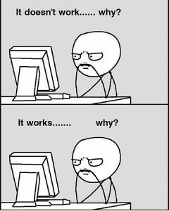

 
#  
### Algumas infos sobre mim:

- 📚 Me encontro no 6º período de SI na CEFET.
- 🧑‍💼 Sou estagiário mas não atuo na área de desenvolvimento.
- 🌊 Prentendo me aprofundar como Dev Mobile Backend.

Aqui lançarei alguns projetos diversos, tanto pessoais como da faculdade. A ideia é que sirva como portfólio e também para mapear minha evolução.

# **Profile Stats** (tá patético, liga não 😢)
Com o tempo a gente vai melhorando isso aqui!

 

 
#

 
    
    
    &nbsp;

#

 
     
     
    
    

> Silent battles are being fought, be kind.
    
